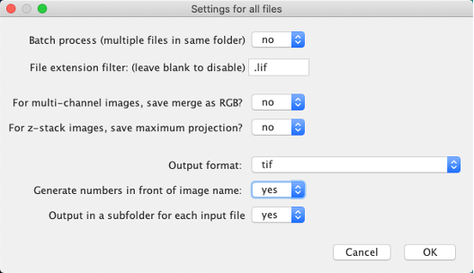
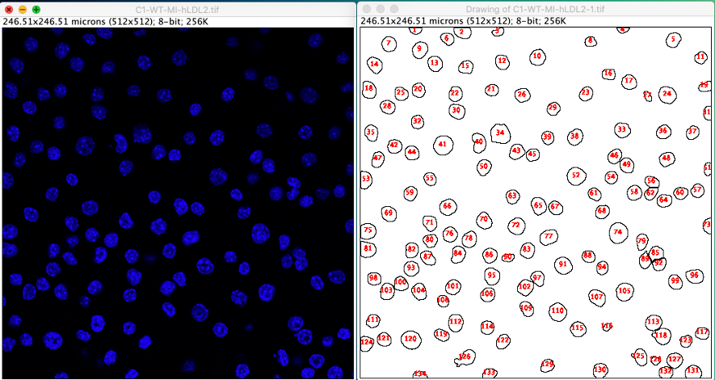
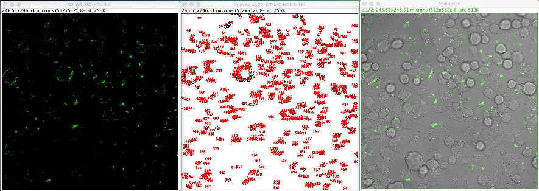

## Lipid Droplet Analysis ##
An ImageJ/FIJI automated Macro to analyze Cell Lipid Droplets

The main objective of this macro is to perform a semiautomated batch analysis of differernt parameters of lipid droplets in either confocal or fluorescence microscopy images using ImageJ/FIJI software
BATCH PROCESSING FOR LIPID DROPLET ANALYSIS IN ImageJ/FIJI

**BEFORE RUNNING THE MACRO FOR THE FIRST TIME!!!**

*In Windows OS based systems*

Open it with FIJI and change the lines  87 and 91 of the Macro "LD Analysis_1.0.ijm" to save the results in the desired folder:

87 saveAs("results","C: "Users" User" Carpeta_deseada " +title + "_results.csv");

91 saveAs("Results","C: ?Users?YourUser-Desktop- Carpeta_deseada-Summary.csv");

In the line where we select the threshold method for  lipid droplet detection

69 setAutoThreshold("Huang dark");

We can change for :

69 setAutoThreshold("Default dark"); in the case that will be our preference

The main goal of this automated analysis is the analysis of various parameters (fluorescence intensity, area, etc.) of a BODIPY stain to detect lipid droplets based on detection of the number of cells and number of lipid droplets  by size.

First you´ll need to export all the images contained in the proprietary format Leica  file  (*. lif) to a universal manageable  format such as *. tif  in the same directory

•	Open in FIJI  "Export-as-individual-images_1.6.ijm" and run"Run". If  ImageJ is used  then:  Plugins  > Macro >  Install and then  Plugins  > Macro >  Export-as-individual-images_1.6

•	Filter by Leica File Extension (*.lif)

 

•	Select folder where the *.lif file is located. The program will create a directory with the same name and save the *  files. tif  newly created  and numbered

To automatically analyze images:

•	Open LD Analysis_1.0.ijm and run"Run". If ImageJ  is used  then:  Plugins  > Macro >  Install and then  Plugins  > Macro > LD Analysis_1.0

•	Select Folder where the converted *.tif are located

•	Enter the minimum core detection size (in m2)  (size we already know when we have been fiddling with a sample image of the experiment) and lipid droplets. You will only ask for it in the first image and apply it the same for all. The size to select depends on the cell type and the lens used.

 

With a minimum size  of 20-40  m2 per nucleus we make sure to analyze all cells and not cell debris. For  lipid droplets what we want is to analyze everything and regardless of circularity, hence the minimum size must be small (not 0, but almost, let´s say 0.15-0.20) and the circularity is programmed between 0.00 and 1.00.

Enjoy the analysis...

•	Import *.csv files into Microsoft Excel

 
To get the number of lipid droplets  per cell you would have to divide the total number by the number of cells in each file located in the corresponding count column  of  the Summary file.csv

